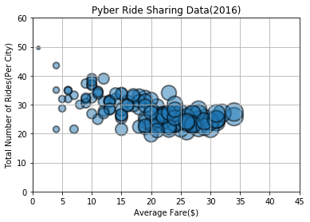
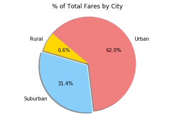
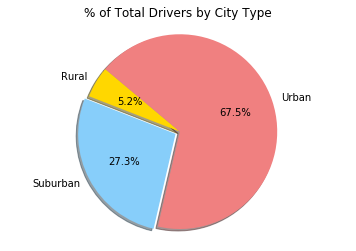

```python
# Dependencies
import matplotlib.pyplot as plt
import pandas as pd
import numpy as np

from scipy import stats
```


```python
# Load in csv
city_data = "../homework/city_data.csv"
ride_data = "../homework/ride_data.csv"

city_data_df = pd.read_csv(city_data)
ride_data_df = pd.read_csv(ride_data)
```


```python
#Merge the two datasets so that no data is lost
combined_data_df = pd.merge(city_data_df, ride_data_df)
combined_data_df.head()
```


<div>
<style>
    .dataframe thead tr:only-child th {
        text-align: right;
    }

    .dataframe thead th {
        text-align: left;
    }

    .dataframe tbody tr th {
        vertical-align: top;
    }
</style>
<table border="1" class="dataframe">
  <thead>
    <tr style="text-align: right;">
      <th></th>
      <th>city</th>
      <th>driver_count</th>
      <th>type</th>
      <th>date</th>
      <th>fare</th>
      <th>ride_id</th>
    </tr>
  </thead>
  <tbody>
    <tr>
      <th>0</th>
      <td>Kelseyland</td>
      <td>63</td>
      <td>Urban</td>
      <td>2016-08-19 04:27:52</td>
      <td>5.51</td>
      <td>6246006544795</td>
    </tr>
    <tr>
      <th>1</th>
      <td>Kelseyland</td>
      <td>63</td>
      <td>Urban</td>
      <td>2016-04-17 06:59:50</td>
      <td>5.54</td>
      <td>7466473222333</td>
    </tr>
    <tr>
      <th>2</th>
      <td>Kelseyland</td>
      <td>63</td>
      <td>Urban</td>
      <td>2016-05-04 15:06:07</td>
      <td>30.54</td>
      <td>2140501382736</td>
    </tr>
    <tr>
      <th>3</th>
      <td>Kelseyland</td>
      <td>63</td>
      <td>Urban</td>
      <td>2016-01-25 20:44:56</td>
      <td>12.08</td>
      <td>1896987891309</td>
    </tr>
    <tr>
      <th>4</th>
      <td>Kelseyland</td>
      <td>63</td>
      <td>Urban</td>
      <td>2016-08-09 18:19:47</td>
      <td>17.91</td>
      <td>8784212854829</td>
    </tr>
  </tbody>
</table>
</div>


```python
# Bubble Plot of Ride Sharing Data
# Create a group based on city
city = combined_data_df.groupby('city')
city

# Average Fare ($) Per City
avg_fare = city['fare'].mean()
avg_fare

# Total Number of Rides Per City
total_rides = city['ride_id'].count()
total_rides

# Total Number of Drivers Per City
total_drivers = city['driver_count'].count()
total_drivers

# City Type (Urban, Suburban, Rural)
city_type = city['type'].value_counts()
city_type.head()
```


    city          type    
    Alvarezhaven  Urban       31
    Alyssaberg    Urban       26
    Anitamouth    Suburban     9
    Antoniomouth  Urban       22
    Aprilchester  Urban       19
    Name: type, dtype: int64


```python
# Set up data
x = total_rides
y = avg_fare
z = total_drivers

# Set the limits for x_axis and y_axis
plt.xlim(0,45)
plt.ylim(0,60)

plt.title("Pyber Ride Sharing Data(2016)")
plt.scatter(x, y, s=z*15, cmap="Blues", alpha=0.5, edgecolors="black", linewidth=2)

# Add titles on axis
plt.xlabel("Average Fare($)")
plt.ylabel("Total Number of Rides(Per City)")
plt.grid()
plt.show()
```





```python
# Total Fares by City Type
# Create a group based on type
fares_type = combined_data_df.groupby('type')

# Total fares per city
Total_fares = fares_type['fare'].sum()
Total_fares

```


    type
    Rural        4255.09
    Suburban    20335.69
    Urban       40078.34
    Name: fare, dtype: float64


```python
# Create a bar chart based off of the group series for total city fares
faretype = ["Rural", "Suburban", "Urban"]
total_fare = [4255.09,20335.69,40078.34]
colors = ["gold", "lightskyblue", "lightcoral"]
explode = (0, 0.05, 0)

plt.title("% of Total Fares by City")
plt.pie(total_fare, explode=explode, labels=faretype, colors=colors, autopct="%1.1f%%", shadow=True, startangle=140)
plt.axis("equal")

plt.show()

```





```python
# Total Rides by City Type
# Create a group based on type
fares_type = combined_data_df.groupby('type')

# Count total rides per city type
count_rides = fares_type['city'].count()
count_rides

```


    type
    Rural        125
    Suburban     657
    Urban       1625
    Name: city, dtype: int64


```python
# Create a bar chart based off of the group series for total city rides
faretype = ["Rural", "Suburban", "Urban"]
total_rides = [125,657,1625]
colors = ["gold", "lightskyblue", "lightcoral"]
explode = (0, 0.05, 0)

plt.title("% of Total Rides by City Type")
plt.pie(total_rides, explode=explode, labels=faretype, colors=colors, autopct="%1.1f%%", shadow=True, startangle=140)
plt.axis("equal")

plt.show()
```


```python
# Total Drivers by City Type
# Create a group based on cities 
fares_type = combined_data_df.groupby('type')

# Count how total drivers per city
count_drivers = fares_type['driver_count'].count()
count_drivers
```


    type
    Rural        125
    Suburban     657
    Urban       1625
    Name: driver_count, dtype: int64


```python
# Create a bar chart based off of the group series for total city rides
faretype = ["Rural", "Suburban", "Urban"]
total_drivers = [125,657,1625]
colors = ["gold", "lightskyblue", "lightcoral"]
explode = (0, 0.05, 0)

plt.title("% of Total Drivers by City Type")
plt.pie(total_drivers, explode=explode, labels=faretype, colors=colors, autopct="%1.1f%%", shadow=True, startangle=140)
plt.axis("equal")

plt.show()
```





```python
# Three trends based on analysis
# 1- Urban cities have a higher percentage of rides.
# 2- There were more drivers in the urban city incomaprison to rural or suburban cities.
# 3- The average fare in the urban cities were more costly incomparsion to rural or suburbs. 
```
